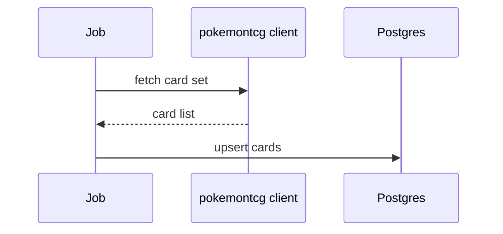

# /pr

Open a pull request on GitHub for the current branch, against `main` by default.

## Arguments

- `/pr` — compare current branch against `main`, open a PR.
- `/pr <base-branch>` — compare against a different base (e.g. `/pr develop`).

## Preconditions

- A GitHub remote is configured (`git remote -v` shows an `origin` pointing at GitHub).
- `gh` CLI is installed and authenticated (`gh auth status`).
- The current branch is not `main` and has at least one commit ahead of the base.

If any precondition is missing, report what's wrong and stop.

## Execution

### Step 1 — Gather context

Run each separately, never with `$()` substitution:

```bash
git branch --show-current
git status
git log <base>..HEAD --oneline
git diff <base>...HEAD --stat
git diff <base>...HEAD
```

Use the literal base branch name (`main` by default, or the argument).

### Step 2 — Push the branch if needed

```bash
git rev-parse --abbrev-ref --symbolic-full-name '@{u}'   # check upstream
```

If no upstream is set, push and set it:

```bash
git push -u origin <current-branch>
```

### Step 3 — Draft the PR

**Title** — Conventional Commits format, ≤ 72 chars, imperative, no trailing period:

```
feat(sources): add pokemontcg.io client and card table
fix(matcher): drop ungrounded condition extractions
chore(ci): bump setup-uv to v3
```

If the branch contains multiple commit types, pick the highest-impact one (`feat` beats `fix` beats `chore`).

**Body** — keep it short. The template:

```markdown
## Summary
<2–3 sentences: what changed and why>

## Changes
- bullet, one per logical change
- another bullet

## How to test
- step the reviewer (or future-you) can actually run
- include any setup commands if non-obvious

## Notes
<optional — flag anything that needs follow-up, or a tradeoff worth recording>
```

**Architecture diagrams.** Include a Mermaid diagram *only when it actually clarifies* — a new data flow, an API change, a schema migration. Don't force one on a typo fix.



### Step 4 — Open the PR

Write the body to a temp file (so `gh` reads it cleanly):

```bash
gh pr create \
  --base <base> \
  --title "<title>" \
  --body-file <(printf '%s' "<body>")
```

…or simpler with a real file via the Write tool to `.git/PR_BODY.md`, then:

```bash
gh pr create --base <base> --title "<title>" --body-file .git/PR_BODY.md
```

Report the PR URL when done.

## What to avoid

- Including JIRA-style ticket IDs (this project doesn't use JIRA).
- Mandatory diagrams on small PRs — only diagram when it helps.
- Pushing to `main` directly. Always go through a PR.
- `--no-verify` or `--admin` flags unless the user explicitly asks.
- Filing a PR with zero commits ahead of base — report and stop.
